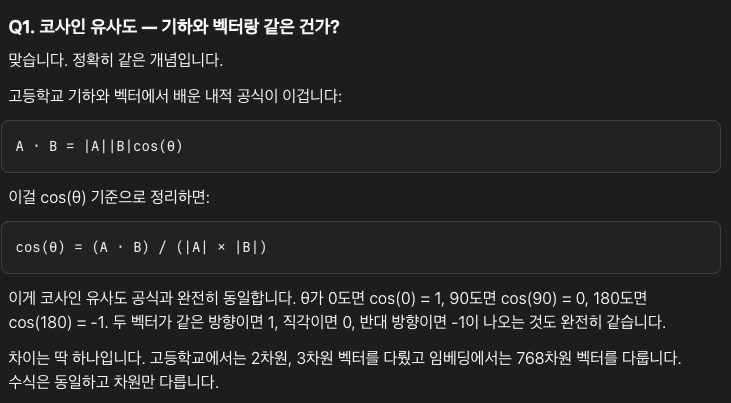
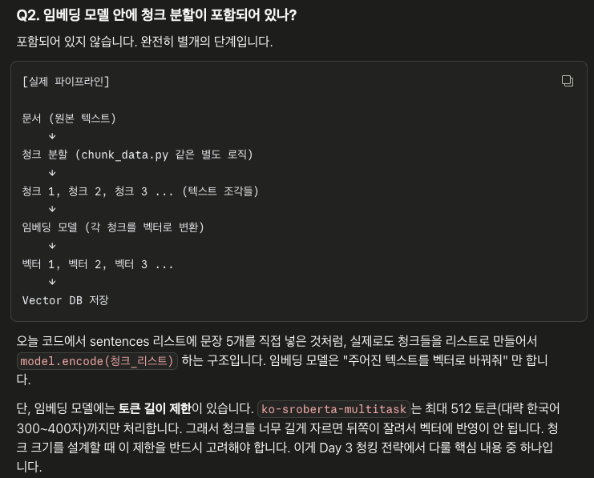
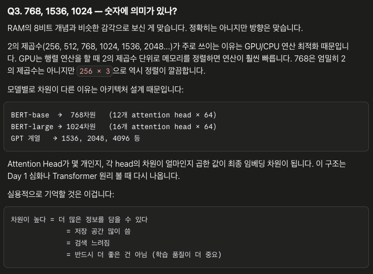

모델마다 성능이 다릅니다. 선택할 때 보는 기준은 세 가지입니다.
언어: 한국어 데이터가 포함된 모델을 써야 합니다. text-embedding-ada-002 같은 영어 위주 모델은 한국어에서 성능이 떨어집니다.
벤치마크: MTEB(Massive Text Embedding Benchmark) 리더보드에서 한국어 점수를 보면 됩니다. 지금 두 프로젝트에서 쓰는 jhgan/ko-sroberta-multitask는 한국어 특화 모델 중 준수한 수준입니다.

>> 차원이 높을수록 → 정확도 높음, 저장 공간 많이 씀, 검색 느림
>> 차원이 낮을수록 → 정확도 낮음, 저장 공간 적음, 검색 빠름
ko-sroberta-multitask: 768차원
text-embedding-3-small: 1536차원 (축소 가능)

| 모델 | 차원 | 특징 |
|-------|-------|-------|
| jhgan/ko-sroberta-multitask768 | 768 | 한국어 특화, 지금 사용 중 |
| intfloat/multilingual-e5-large | 1024 | 다국어, 성능 좋음 |
| text-embedding-3-small | 1536 | OpenAI, 비용 발생, 높은 성능|
| upstage/solar-embedding-1-large | 4096 | 한국어 최상위권, 비용 발생 |

